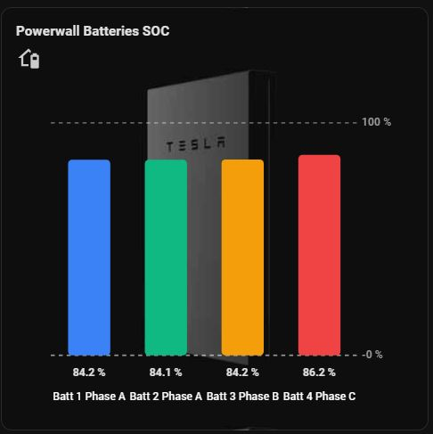

# 1 to 4 Bar Chart

A custom **Home Assistant Lovelace card** that displays **1–4 entities** as a vertical or horizontal bar chart, with a full GUI configuration editor.

**Card type:** `custom:one-to-four-bar-chart`  
**Resource file:** `1_to_4_bar_chart.js`



---

## What it’s for

Use this card when you want a compact comparison of a few related sensors on a dashboard, for example:

- Battery / Powerwall state of charge (SOC) side by side  
- Solar production (house vs shed vs total)  
- Grid import vs export  
- Temperatures, loads, or any numeric sensors  

It is **not** a multi-hour history graph. Bars show **current values** (optionally scaled against a 24h history range or fixed limits).

---

## Features overview

| Area | Capabilities |
|------|----------------|
| **Series** | 1–4 entities, custom labels, units, colour, ± colours, gradients |
| **Layout** | Vertical or horizontal bars |
| **Scale** | Auto, fixed min/max, or 24h history extremes |
| **Bounds** | Optional upper/lower reference lines with labels |
| **Min/Max input** | Static number, `entity_id`, or Jinja template |
| **Units** | Per-series factor (e.g. W → kW) and optional custom unit text |
| **Labels** | Value labels (position + hover/tap/always), series name colours, optional Y-region labels |
| **Interaction** | Click bar or series name → entity **more-info** dialog |
| **Appearance** | Title, icon, height scale, decimals, solid/gradient/image background |
| **Editor** | Full UI editor (entity picker, icon picker, colour pickers, etc.) |

---

## Installation

1. Copy `1_to_4_bar_chart.js` to your HA config, e.g.  
   `config/www/1_to_4_bar_chart.js`
2. Add a Lovelace resource (Dashboard → ⋮ → Resources, or YAML):

```yaml
url: /local/1_to_4_bar_chart.js
type: module
```

3. Reload resources / refresh the browser (hard refresh if needed).
4. Add card → search **“1 to 4 Bar Chart”**, or use YAML:

```yaml
type: custom:one-to-four-bar-chart
title: Powerwall Batteries SOC
entities:
  - entity: sensor.battery_1_soc
    name: Batt 1
    color: "#3B82F6"
```

The script **self-registers** with Home Assistant’s card picker via `window.customCards` (see [Self-registration](#self-registration) below). You do not need a separate `card-tools` dependency.

---

## Self-registration

On load, the file:

1. Pushes a card definition into `window.customCards` so it appears in the **Add card** UI  
2. Defines two custom elements:
   - `one-to-four-bar-chart` — the card  
   - `one-to-four-bar-chart-editor` — the visual editor  

```js
window.customCards.push({
  type: "one-to-four-bar-chart",
  name: "1 to 4 Bar Chart",
  description: "...",
  preview: true,
});

customElements.define('one-to-four-bar-chart', OneToFourBarChartCard);
customElements.define('one-to-four-bar-chart-editor', OneToFourBarChartEditor);
```

Static methods on the card class:

| Method | Purpose |
|--------|---------|
| `getConfigElement()` | Returns the editor element for the GUI config flow |
| `getStubConfig()` | Default config when you add a new card from the picker |

---

## Configuration reference

### Top-level options

| Option | Type | Default | Description |
|--------|------|---------|-------------|
| `title` | string | — | Card title |
| `icon` | string | — | MDI icon under the title (e.g. `mdi:battery`) |
| `entities` | array | **required** | 1–4 series configs (see below) |
| `orientation` | `vertical` \| `horizontal` | `vertical` | Bar direction |
| `value_label_position` | `top` \| `bottom` \| `both` \| `none` | `top` | Where value text sits relative to the bar (`top` = outer end, `bottom` = near baseline) |
| `value_label_trigger` | `always` \| `hover` \| `tap` | `always` | When value labels are visible |
| `decimals` | number 0–6 | `1` | Decimal places for value and bound labels (trailing zeros trimmed) |
| `scale_mode` | `auto` \| `fixed` \| `history_24h` | `auto` | How min/max of the chart are chosen |
| `min_value` | number \| entity_id \| Jinja \| null | `null` | Scale minimum and/or lower bound source |
| `max_value` | number \| entity_id \| Jinja \| null | `null` | Scale maximum and/or upper bound source |
| `show_zero_line` | boolean | `true` | Dashed zero line when scale crosses 0 |
| `show_upper_bound` | boolean | `false` | Draw upper reference line |
| `show_lower_bound` | boolean | `false` | Draw lower reference line |
| `label_upper_bound` | boolean | `false` | Show numeric label on upper line |
| `label_lower_bound` | boolean | `false` | Show numeric label on lower line |
| `show_y_labels` | boolean | `false` | Region labels (e.g. Export / Import) |
| `y_label_above` | string | — | Label for positive side of zero |
| `y_label_below` | string | — | Label for negative side of zero |
| `height_scale` | number | `1` | Multiplier for chart height (~0.5–3) |
| `background_type` | `solid` \| `gradient` \| `image` | `solid` | Card background style |
| `bg_color` | string | theme / dark grey | Solid background (hex or CSS variable) |
| `bg_gradient_start` / `bg_gradient_end` | string | — | Gradient colours |
| `bg_image_url` | string | — | Background image URL |
| `bg_image_fit` | `cover` \| `contain` \| `fill` \| `center` | `cover` | Image sizing |
| `bg_opacity` | number | `0.2` | Dark overlay when using an image |

### Per-entity (`entities[]`) options

| Option | Type | Default | Description |
|--------|------|---------|-------------|
| `entity` | string | — | Home Assistant entity id |
| `name` | string | friendly name | Series label on the chart |
| `name_color` | string | theme secondary | Colour of the series name |
| `unit` | string | entity unit | Override unit text on labels |
| `factor` | number | `1` | Multiplier applied to live state **and** 24h history (e.g. `0.001` for W→kW) |
| `color` | string | palette | Bar colour when value ≥ 0 |
| `color_negative` | string | — | Bar colour when value &lt; 0 |
| `color_mode` | `solid` \| `gradient` | `solid` | Fill style |
| `color_end` | string | — | Gradient end colour (positive) |
| `color_end_negative` | string | — | Gradient end colour (negative) |

---

## Scale modes

### Auto (`auto`)
Min/max derived from **current** bar values (with light padding). All-positive data typically floors at 0.

### Fixed (`fixed`)
Scale uses resolved **Min** and **Max**. Those values are also used for bound lines when those options are enabled.

### 24h history (`history_24h`)
Fetches 24 hours of history via the WebSocket API (`history/history_during_period`), applies each series’ **factor**, and sets scale from the combined history + current values. Useful so a short bar still sits in a meaningful daily context.

---

## Min / Max: numbers, entities, and templates

`min_value` and `max_value` accept:

| Kind | Example |
|------|---------|
| Static number | `100` |
| Entity id | `sensor.battery_capacity` |
| Jinja template | `{{ states('sensor.a') \| float(0) * 1.1 }}` |

**Resolution order**

1. Looks like Jinja (`{{` or `{%`) → HA `render_template` subscription (live updates)  
2. Looks like `domain.object_id` → entity state  
3. Otherwise → parsed as a number  

**How they interact with scale and bound lines**

| Mode | Role of Min/Max |
|------|------------------|
| **Fixed** | Define the scale; bound lines sit on those limits when enabled |
| **Auto / 24h** | Optional overrides: if set and bound lines are on, scale **expands** so the bound is always on the plot; if Min/Max empty but “show bound line” is on, the line marks the **computed** scale edge (e.g. 24h peak) |

Leave Min/Max empty in auto/24h when you only want data-driven scaling with no override.

---

## Reference lines

- **Zero line** — only when min &lt; 0 &lt; max and `show_zero_line` is true  
- **Upper / lower bounds** — dashed lines in the same style; optional value labels (respecting **Decimals** and the first series’ unit when set)

---

## Orientation

- **Vertical** — classic columns; series names under bars; zero/bounds horizontal  
- **Horizontal** — bars grow left/right; series names on the left; zero/bounds vertical  

Y-region labels (`y_label_above` / `y_label_below`) adapt: rotated on the left in vertical mode; upright above the value axis in horizontal mode.

---

## Interaction

- **Click** a bar or its series label → `hass-more-info` for that entity  
- **Keyboard** — focus the bar group (Tab) and press Enter or Space  

Clicks use a full column/row hit target so more-info works reliably on the bar and the label.

---

## Card behaviour (runtime)

### Lifecycle

| Step | What happens |
|------|----------------|
| `setConfig(config)` | Merges defaults, validates `entities`, sets up min/max resolvers, optional history fetch, renders |
| `set hass(hass)` | Updates entity data; skips full re-render if watched states are unchanged (reduces flicker); refreshes entity-based bounds |
| `disconnectedCallback` | Unsubscribes Jinja template listeners |

### Rendering pipeline (simplified)

1. Read up to 4 entities → apply **factor** → build bar values  
2. Resolve scale via `getMinMaxValues` (auto / fixed / history + bound overrides)  
3. Build SVG: bars, labels, zero/bound lines, optional gradients  
4. Apply background, title, icon  

### Performance notes

- Full SVG rebuild only when a **watched entity state** changes (series entities + entity-type min/max)  
- Template min/max update via subscription and trigger their own render  
- Hover styles avoid CSS `filter` on bars (that caused unreliable clicks / flicker in SVG)

---

## GUI editor

Opened from the standard Lovelace **Configure card** UI (`getConfigElement()`).

### Editor capabilities

- **Card title** (text)  
- **Card icon** (`ha-icon-picker` when available, else text)  
- **Entities** (up to 4):
  - `ha-entity-picker` when HA components load successfully  
  - Label, label colour, unit, factor  
  - Fill mode (solid/gradient), bar + / − colours, gradient ends  
  - Add / remove series  
- **Orientation**, value label position & trigger  
- **Scale mode**, Min/Max (text — number / entity / template)  
- Zero line, reference line toggles + labels  
- Y-axis region labels  
- Height scale & decimals  
- Background type and related colour / image fields  

### Editor UX details

- Uses **`change`** events (not `input`) so typing in text fields does not steal focus  
- Structural changes (scale mode, background type, entity count, etc.) re-render the form; value-only changes **sync in place** where possible  
- Loads `ha-entity-picker` / `ha-icon-picker` by invoking known HA card config elements when needed  

---

## YAML examples

### SOC with 100% ceiling

```yaml
type: custom:one-to-four-bar-chart
title: Powerwall Batteries SOC
icon: mdi:home-battery
orientation: vertical
scale_mode: auto
max_value: 100
show_upper_bound: true
label_upper_bound: true
decimals: 1
entities:
  - entity: sensor.pw_batt_1_soc
    name: Batt 1
    color: "#3B82F6"
    unit: "%"
  - entity: sensor.pw_batt_2_soc
    name: Batt 2
    color: "#10B981"
    unit: "%"
```

### Power in kW with factor and ± colours

```yaml
type: custom:one-to-four-bar-chart
title: Grid
orientation: horizontal
scale_mode: history_24h
show_zero_line: true
show_y_labels: true
y_label_above: Export
y_label_below: Import
entities:
  - entity: sensor.grid_power_w
    name: Grid
    factor: 0.001
    unit: kW
    color: "#3B82F6"
    color_negative: "#EF4444"
```

### Dynamic max from template

```yaml
type: custom:one-to-four-bar-chart
title: Load vs capacity
scale_mode: fixed
min_value: 0
max_value: "{{ states('sensor.inverter_max_w') | float(0) * 0.001 }}"
show_upper_bound: true
label_upper_bound: true
entities:
  - entity: sensor.house_load_w
    name: House
    factor: 0.001
    unit: kW
    color: "#F59E0B"
```

### Background image

```yaml
type: custom:one-to-four-bar-chart
title: House / Shed Solar
background_type: image
bg_image_url: /local/images/solar_bg.png
bg_image_fit: cover
bg_opacity: 0.35
orientation: horizontal
entities:
  - entity: sensor.house_solar_kw
    name: House
    color: "#F59E0B"
  - entity: sensor.shed_solar_kw
    name: Shed
    color: "#EF4444"
```

---

## Troubleshooting

| Symptom | Things to check |
|---------|------------------|
| Card missing from picker | Resource URL, `type: module`, hard refresh |
| Entity picker missing in editor | HA version / frontend load; fallback text field still works |
| 24h scale looks wrong | Recorder enabled for those entities; **factor** applied to history and live values |
| Bound line missing | Enable show upper/lower; ensure resolved min/max is valid; fixed mode needs Min/Max set |
| Template min/max not updating | Valid Jinja; entity available; check browser console for subscribe errors |
| more-info unreliable | Use latest file (hit target + render gating); click bar or series label |
| Flickering bars | Ensure you have the version that only re-renders on relevant state changes |

---

## File map (code structure)

| Class / area | Role |
|--------------|------|
| `OneToFourBarChartCard` | Card element: config, hass, history, scale, SVG render, more-info |
| `OneToFourBarChartEditor` | Shadow-DOM form editor, config-changed events |
| Bound resolvers | Number / entity / Jinja for `min_value` & `max_value` |
| `getMinMaxValues` | Scale + bound line positions |
| `formatNumber` | Shared decimal formatting |
| `_barFill` / `_gradientDef` | Solid vs gradient fills, ± colours |

---

## Requirements

- Home Assistant with Lovelace  
- For **24h history scale**: Recorder (or equivalent history) for the selected entities  
- For **Jinja min/max**: standard HA template engine (frontend WebSocket)  
- Modern browser with ES module support  

---

## License / usage

Provide and maintain this file as part of your own HA config or share it as you prefer. No external npm package is required; it is a single self-contained module.
